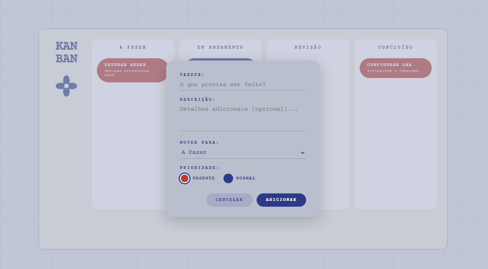
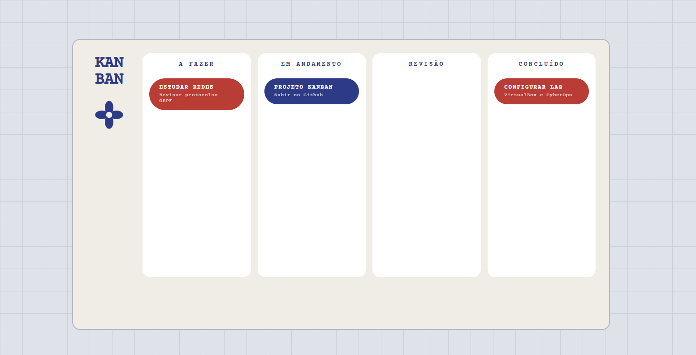

# 📋 Quadro Kanban Acadêmico

Este projeto consiste em um Quadro Kanban funcional desenvolvido para a disciplina de **MODELOS, MÉTODOS E TÉCNICAS DA ENGENHARIA DE SOFTWARE**. 

O objetivo é aplicar conceitos de agilidade e gestão visual de tarefas no ciclo de desenvolvimento de software.

Você pode acessar e visualizar o quadro Kanban através do link abaixo:
https://sarahpsps.github.io/Quadro-Kanban/

## Funcionalidades:
- Gerenciamento de tarefas em três colunas (A Fazer, Em Progresso, Concluído).
- Interface interativa com sistema de "Arraste e Solte" (Drag and Drop).
- Design responsivo e limpo para facilitar a visualização.

## Tecnologias Utilizadas:
- **HTML5**: Estruturação semântica.
- **CSS3**: Estilização e layout responsivo.
- **JavaScript**: Lógica de movimentação dos cards e manipulação do DOM.

## Contexto Acadêmico
O projeto foi desenvolvido como parte prática do estudo de metodologias ágeis e técnicas de engenharia de software, visando a compreensão de fluxos de trabalho (workflow) e organização de requisitos em um ambiente simulado de desenvolvimento.

